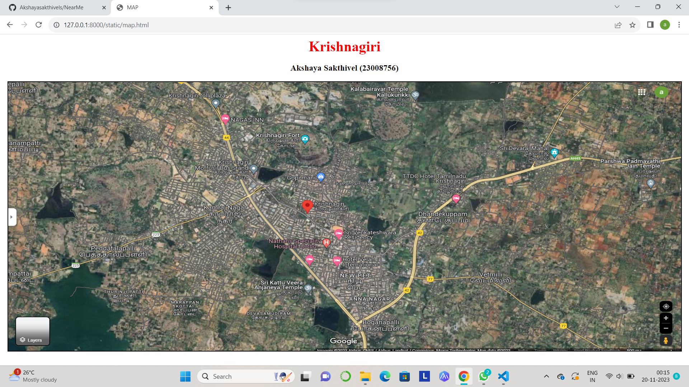
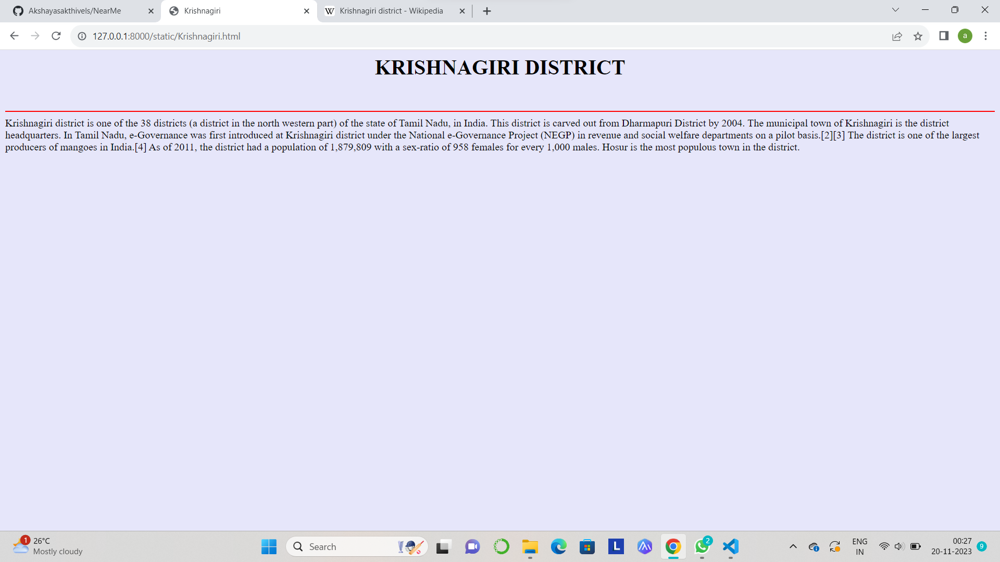
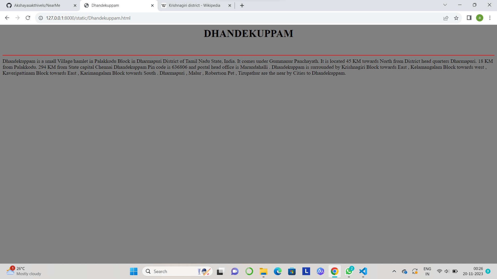
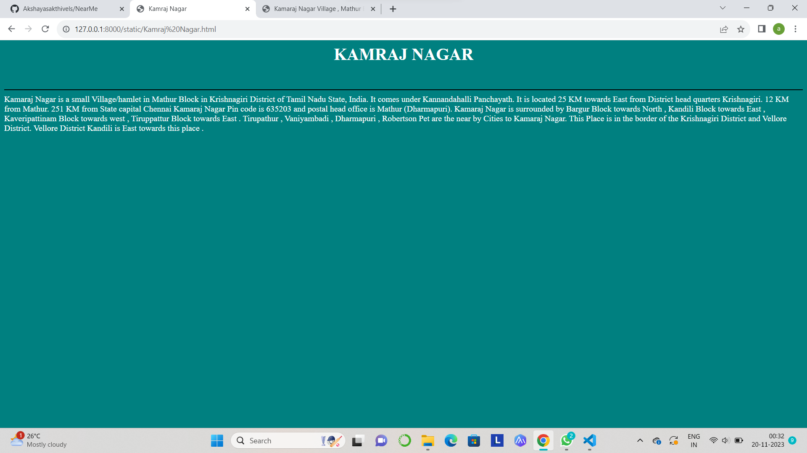
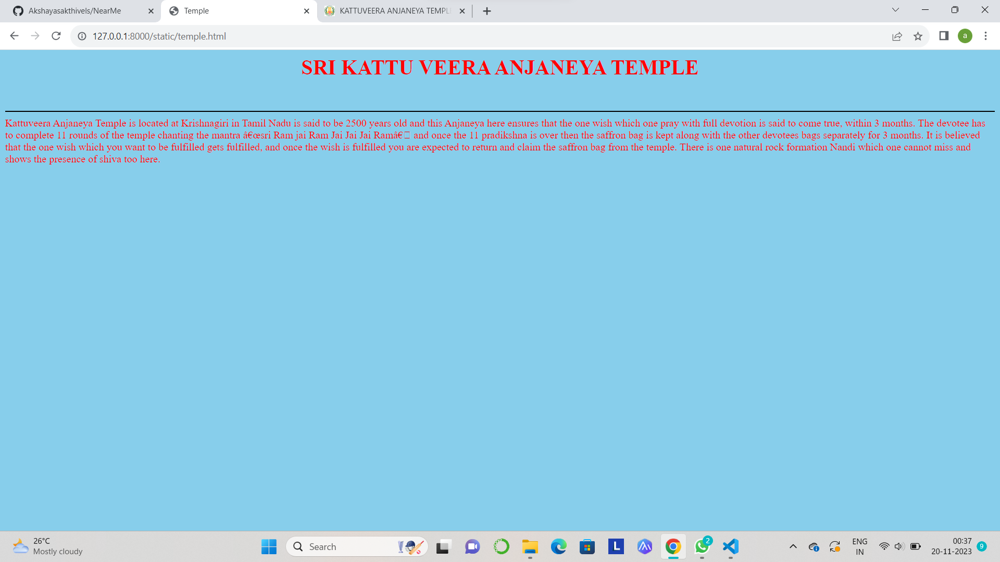
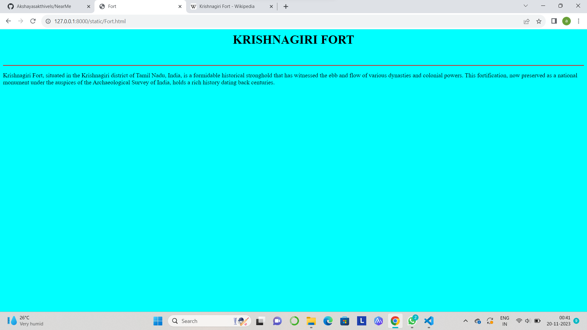

# Ex04 Places Around Me
## Date: 20/11/23
## AIM
To develop a website to display details about the places around my house.

## DESIGN STEPS

### STEP 1
Create a Django admin interface.

### STEP 2
Download your city map from Google.

### STEP 3
Using <map> tag name the map.

### STEP 4
Create clickable regions in the image using <area> tag.

### STEP 5
Write HTML programs for all the regions identified.

### STEP 6
Execute the programs and publish them.

## CODE
```
map.html

<html>
<head>
<title>MAP</title>
</head>
<body>
<center>
<font size="6" color="red"><b>Krishnagiri</b></font>
<br>
<h3 text="black">Akshaya Sakthivel (23008756)</h3>
<map name="MAP">
<area shape="rect" coords="520,100,670,150" href="Fort.html" title="Krishnagiri Fort">
<area shape="rect" coords="520,430,670,480" href="temple.html" title="Sri kattu Veera Anjaneya Temple">
<area shape="rect" coords="420,250,530,310" href="Kamraj Nagar.html" title="Kamraj Nagar">
<area shape="rect" coords="900,270,1030,330" href="Dhandekuppam.html" title="Dhandekuppam">
<area shape="rect" coords="650,240,760,300" href="Krishnagiri.html" title="Krishnagiri">
</map>
</center>
</body>
</html>

Krishnagiri.html

<html>
<head>
<title>Krishnagiri</title>
</head>
<body bgcolor="lavender" text="black">
<center>
<h1>KRISHNAGIRI DISTRICT</h1>
<br>
</center>
<hr color="red"
<p>
    Krishnagiri district is one of the 38 districts (a district in the north western part) of the state of Tamil Nadu, in India. This district is carved out from Dharmapuri District by 2004. The municipal town of Krishnagiri is the district headquarters. In Tamil Nadu, e-Governance was first introduced at Krishnagiri district under the National e-Governance Project (NEGP) in revenue and social welfare departments on a pilot basis. The district is one of the largest producers of mangoes in India. As of 2011, the district had a population of 1,879,809 with a sex-ratio of 958 females for every 1,000 males. Hosur is the most populous town in the district.
</p>
</body>
</html>

Dhandekuppam.html

<html>
<head>
<title>Dhandekuppam</title>
</head>
<body bgcolor="grey" text="black">
<center>
<h1>DHANDEKUPPAM</h1>
<br>
</center>
<hr color="red"
<p>
Dhandekuppam is a small Village/hamlet in Palakkodu Block in Dharmapuri District of Tamil Nadu State, India. It comes under Gummanur Panchayath. It is located 45 KM towards North from District head quarters Dharmapuri. 18 KM from Palakkodu. 294 KM from State capital Chennai

Dhandekuppam Pin code is 636806 and postal head office is Marandahalli .
    
Dhandekuppam is surrounded by Krishnagiri Block towards East , Kelamangalam Block towards west , Kaveripattinam Block towards East , Karimangalam Block towards South .
    
Dharmapuri , Malur , Robertson Pet , Tirupathur are the near by Cities to Dhandekuppam.
</p>
</body>
</html>

Kamraj Nagar.html

<html>
<head>
<title>Kamraj Nagar</title>
</head>
<body bgcolor="teal" text="white">
<center>
<h1>KAMRAJ NAGAR</h1>
<br>
</center>
<hr color="black"
<p>
    Kamaraj Nagar is a small Village/hamlet in Mathur Block in Krishnagiri District of Tamil Nadu State, India. It comes under Kannandahalli Panchayath. It is located 25 KM towards East from District head quarters Krishnagiri. 12 KM from Mathur. 251 KM from State capital Chennai

    Kamaraj Nagar Pin code is 635203 and postal head office is Mathur (Dharmapuri).
    
    Kamaraj Nagar is surrounded by Bargur Block towards North , Kandili Block towards East , Kaveripattinam Block towards west , Tiruppattur Block towards East .
    
    Tirupathur , Vaniyambadi , Dharmapuri , Robertson Pet are the near by Cities to Kamaraj Nagar.
    
    This Place is in the border of the Krishnagiri District and Vellore District. Vellore District Kandili is East towards this place .
</p>
</body>
</html>
```
temple.html

<html>
<head>
<title>Temple</title>
</head>
<body bgcolor="skyblue" text="red">
<center>
<h1>SRI KATTU VEERA ANJANEYA TEMPLE</h1>
<br>
</center>
<hr color="black"
<p>
    Kattuveera Anjaneya Temple is located at Krishnagiri in Tamil Nadu is said to be 2500 years old and this Anjaneya here ensures that the one wish which one pray with full devotion is said to come true, within 3 months.
    The devotee has to complete 11 rounds of the temple chanting the mantra “sri Ram jai Ram Jai Jai Jai Ram” and once the 11 pradikshna is over then the saffron bag is kept along with the other devotees bags separately for 3 months. It is believed that the one wish which you want to be fulfilled gets fulfilled, and once the wish is fulfilled you are expected to return and claim the saffron bag from the temple.
    There is one natural rock formation Nandi which one cannot miss and shows the presence of shiva too here.
</p>
</body>
</html>

Fort.html

<html>
<head>
<title>Fort</title>
</head>
<body bgcolor="cyan" text="black">
<center>
<h1>KRISHNAGIRI FORT</h1>
<br>
</center>
<hr color="red">
<p>
    Krishnagiri Fort, situated in the Krishnagiri district of Tamil Nadu, India, is a formidable historical stronghold that has witnessed the ebb and flow of various dynasties and colonial powers. This fortification, now preserved as a national monument under the auspices of the Archaeological Survey of India, holds a rich history dating back centuries.
</p>
</body>
</html>


## OUTPUT







## RESULT
The program for implementing image maps using HTML is executed successfully.
